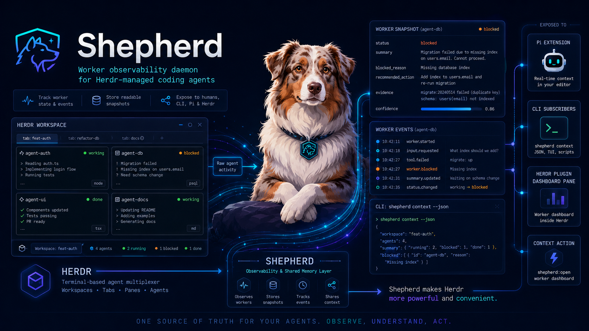

# Shepherd

<!-- README-I18N:START -->
**English** | [日本語](./README.ja.md)
<!-- README-I18N:END -->

Shepherd is a tool for reading the state and compact history of other agents running in Herdr from the CLI.

Herdr's `herdr agent read` can also read another agent's output. However, it reads terminal streams or scrollback, so it is hard to retrieve agent history as structured data and the output includes extra text. Shepherd reads agent session data and provides another agent's work status, latest message excerpts, and unread agent updates in an easier-to-use format.

Shepherd currently supports session history from Claude Code, Codex, Gemini CLI, OpenCode, and Pi.

## Requirements

- Node.js >= 24.18.0
- Herdr >= 0.7.0
- Pi >= 0.80.6 when using `shepherd-pi`

## Install

```bash
npm install --global @ryonakae/shepherd
shepherd help
```

### Install from source

Source builds also require pnpm >= 11.9.0.

```bash
git clone https://github.com/ryonakae/shepherd.git
cd shepherd
pnpm install
pnpm build
npm install --global . --ignore-scripts
shepherd help
```

## Start the daemon

Shepherd agent commands require the daemon. The daemon watches all running Herdr sessions reported by `herdr session list --json`, rescans them every 60 seconds, and does not index stopped Herdr sessions. Runtime files live in `~/.shepherd` by default. Set `SHEPHERD_HOME` to use another directory.

```bash
shepherd daemon start
```

## Main commands

- `shepherd agent list`: returns the daemon's latest cached status and last user / assistant excerpts for the selected workspace. Check each row's `updatedAt` when freshness matters.
- `shepherd agent get <target>`: performs an explicit detail lookup and returns one agent's metadata, compact history, and latest compact tool result.
- `shepherd agent read <target> --limit N`: performs an explicit history read and returns the latest N user / assistant / compact `tool_result` messages.

Inside a Herdr workspace, Shepherd selects the current workspace automatically.

```bash
shepherd agent list --json
shepherd agent get claude --json
shepherd agent read claude --limit 20 --json
```

From outside Herdr, pass a scope.

```bash
shepherd agent list --all --json
shepherd agent list --workspace wB --json
shepherd agent get claude --workspace wB --json
shepherd agent read wB:p2 --workspace wB --limit 20 --json
```

`<target>` can be a pane id, terminal id, or agent name that is unique in the selected scope, following Herdr conventions where possible. Use `--session <name>` when the same workspace id or agent name exists in multiple running Herdr sessions.

## Agent Skill

Install the Shepherd CLI and start its daemon before adding the Agent Skill. Then add the Shepherd instructions to supported coding agents:

```bash
npx skills add ryonakae/shepherd --skill shepherd -g
```

The Shepherd skill reads structured agent status, compact history, and recent tool results. Use it alone for agent inspection.

Add the official Herdr skill when an agent needs to control workspaces, tabs, panes, terminal input/output, or waits:

```bash
npx skills add ogulcancelik/herdr --skill herdr -g
```

## Pi extension

Install the extension through Pi:

```bash
pi install npm:@ryonakae/shepherd-pi
```

The extension requires Pi 0.80.6 or newer and connects to the Shepherd daemon when Pi runs inside Herdr. Each connected Pi registers its exact Pi session path as presence identity, including while off. The extension does not send per-turn tool-result or final-message telemetry.

Enter `/shepherd on` in Pi to make this terminal the sole Shepherd owner for its current Herdr session and workspace. Only the owner receives cached current-workspace agent context, pending counts, agent updates, and automatic wake. Its context excludes its own Pi terminal and includes other Pi terminals. A normal prompt injects the locally cached snapshot without daemon RPC or history reads, so context can be temporarily absent after startup, reconnect, or scope movement until a snapshot arrives.

Completed or blocked agent outcomes start one visible Shepherd turn. If a normal user run is active, Shepherd waits for it to settle. The themed card shows up to three agents; use Pi's expand key to see every outcome and its bounded final response. Agent output is untrusted evidence: Pi may continue only the existing user request and must not expand its scope.

Use `/shepherd` or `/shepherd status` to inspect the current Pi, and `/shepherd off` to release owner behavior for that Pi. Turning one Pi off does not affect another owner. An off or non-owner Pi remains connected for a later claim, but receives no hidden agent context, pending counts, updates, or wake. The active Pi shows `◆ Shepherd`; pending outcomes add `· N agent updates` until a turn containing them produces a final assistant response, settles, and acknowledges every underlying event. A previously active Pi shows `◇ Shepherd · reconnecting` during transport recovery. With no owner, outcomes are not delivered, and outcomes created during the ownerless period are not replayed by a later claim. Reloads, reconnects, and direct replacement by another Pi preserve unacknowledged outcomes. Ownership follows the Herdr terminal across Pi session replacement and pane movement, and clears when that terminal remains disconnected beyond the grace period.

## Herdr plugin

Install the optional plugin from the GitHub release tag:

```bash
herdr plugin install ryonakae/shepherd/packages/shepherd-herdr-plugin --ref v0.4.0 --yes
```

The plugin connects to the Shepherd daemon and shows compact agent rows for the current Herdr workspace. Herdr installs it from the repository subdirectory; it is not published to npm or required for the CLI and Pi extension.

## Packages

| Path | Distribution | Purpose |
| --- | --- | --- |
| repository root | npm: `@ryonakae/shepherd` | Shepherd CLI and daemon. |
| `packages/shepherd-pi` | npm: `@ryonakae/shepherd-pi` | Pi extension for agent history and agent updates. |
| `packages/shepherd-herdr-plugin` | GitHub release subdirectory | Optional Herdr UI integration; not an npm package. |

## Development

```bash
pnpm install
pnpm check
pnpm build
```

See [Releasing Shepherd](./docs/releasing.md) for package validation, npm publication, and GitHub Release steps.

DB schema changes require:

```bash
pnpm db:generate
pnpm db:check
```

## License

[MIT](./LICENSE)
